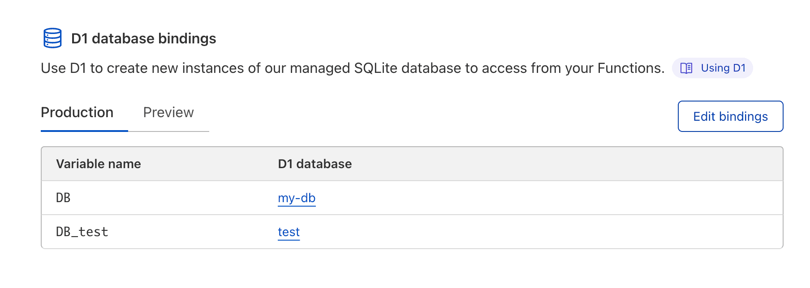
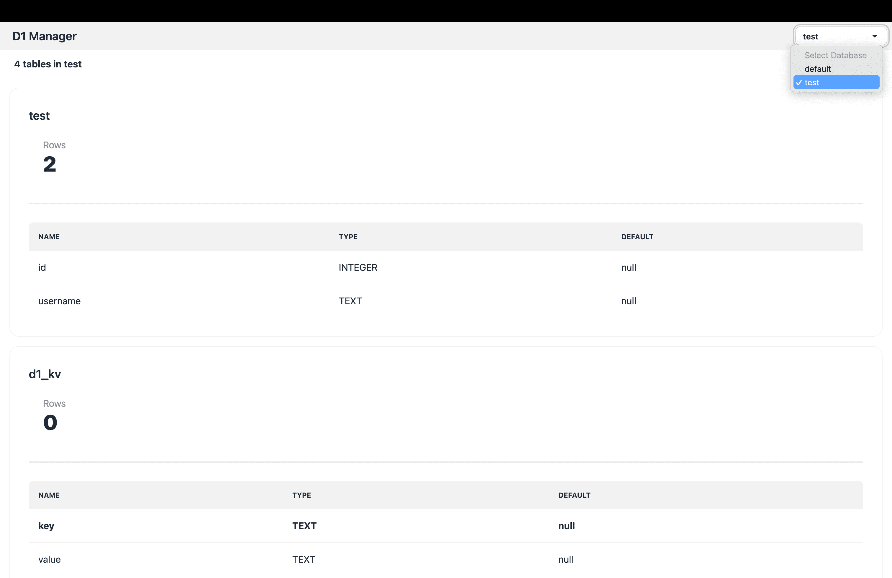
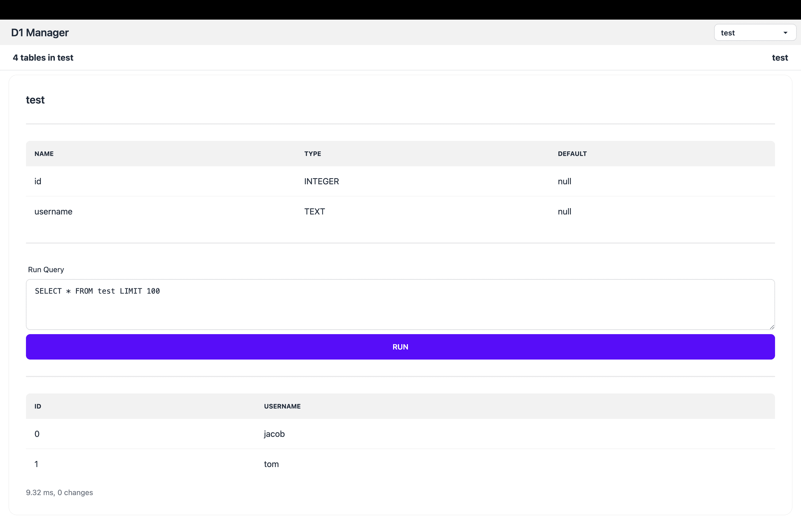

# D1 Manager

D1 Manager is a web UI and API for Cloudflare D1, a serverless SQL database. It provides a user-friendly interface for managing databases, tables, and records, as well as an API for performing operations programmatically. D1 Manager simplifies database management, enabling users to focus on their data.

## Features

- [x] Multiple D1 Databases
- [x] List all tables in a database
- [x] Show table schema
- [x] Run SQL queries
- [ ] Create new table through UI
- [ ] Edit table data through UI
- [ ] Custom SQL scripts
- [x] I18n support (English, Chinese) [add more](./locales/)
- [x] API support (see [routes/api](./src/routes/api/) for details)

## Setup

1. Fork this repo
2. Setup a **Cloudflare Pages** with the forked repo
3. Use **Cloudflare Access** to protect the your site
4. **Bind databases** to `DB_*` environment variables

> Note: You can bind multiple databases to the manager. In theis example, `DB` will be `default` in the UI, and `DB_test` will be `test`.

## Screenshots

