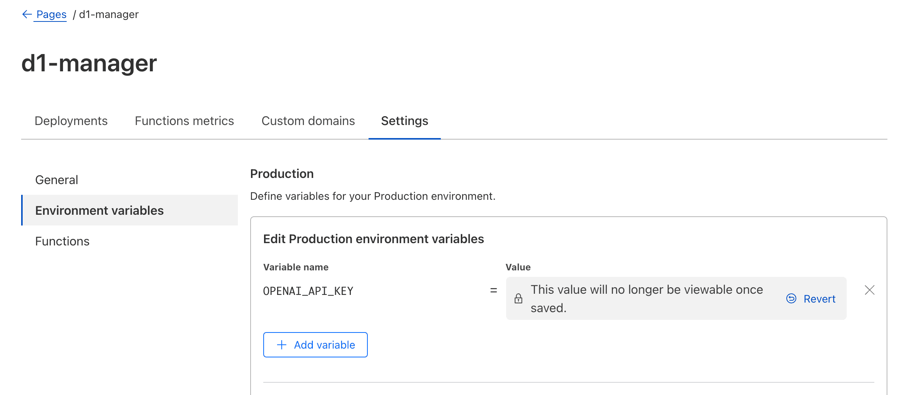
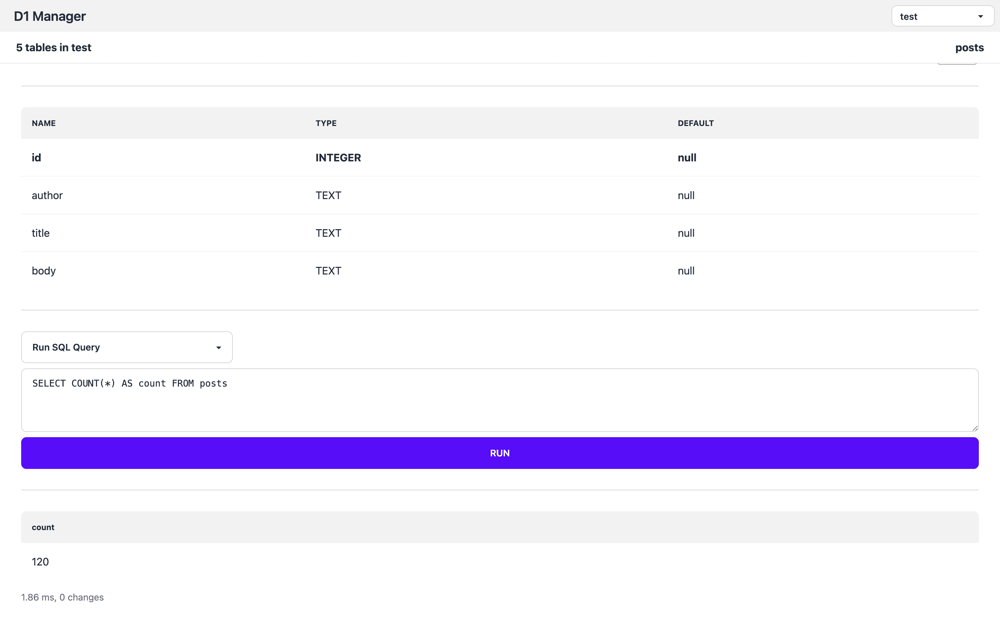
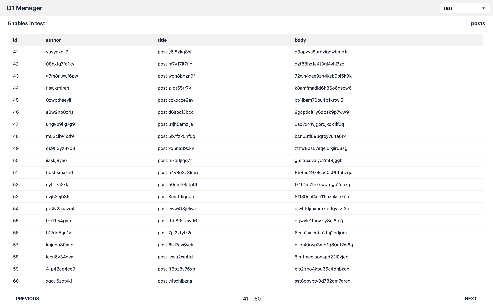
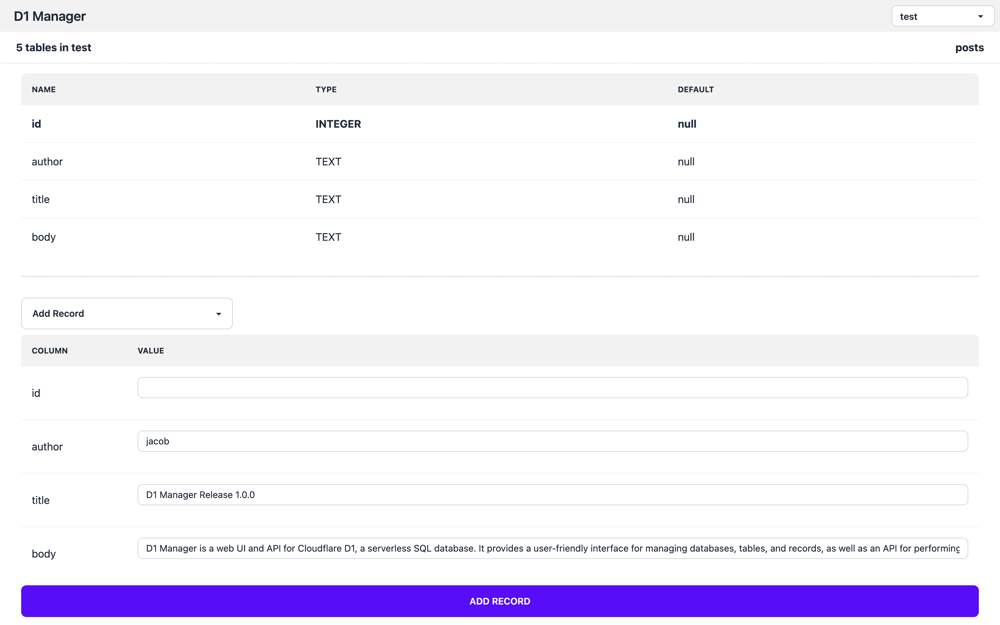
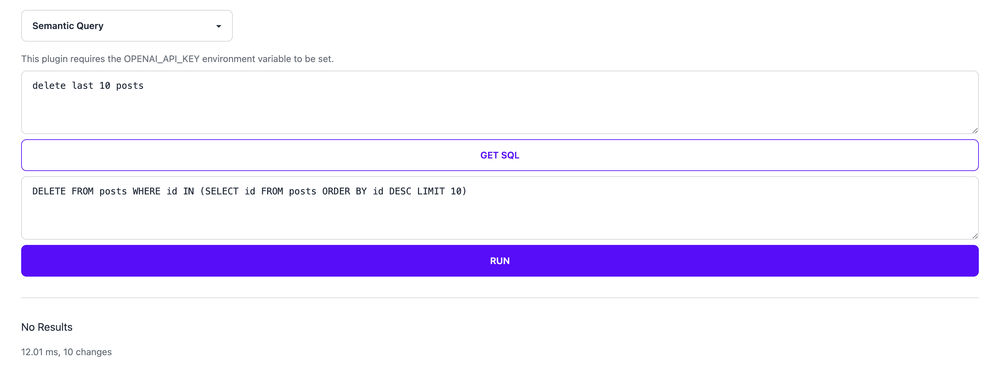

# D1 Manager

D1 Manager is a web UI and API for Cloudflare D1, a serverless SQL database. It provides a user-friendly interface for managing databases, tables, and records, as well as an API for performing operations programmatically. D1 Manager simplifies database management, enabling users to focus on their data.

## Features

-   [x] Multiple D1 Databases
-   [x] List all tables in a database
-   [x] Show table schema
-   [x] Run SQL queries
-   [x] Run Semantic Queries (with `OPENAI_API_KEY` env var set)
-   [x] Edit table data through UI
-   [x] I18n support (English, Chinese) [add more](./locales/)
-   [x] API support (see [routes/api](./src/routes/api/) for details)

## Setup

1. Fork this repo
2. Setup a **Cloudflare Pages** with the forked repo
3. Use **Cloudflare Access** to protect the your site
4. **Bind databases** to `DB_*` environment variables

> Note: You can bind multiple databases to the manager. In theis example, `DB` will be `default` in the UI, and `DB_test` will be `test`.

### Environment Variables

Some plugins (e.g. Semantic Query) require additional environment variables to be set.

Also, there are some configuration options that can be set through environment variables.

-   `SHOW_INTERNAL_TABLES`: Show internal tables (`splite_*` and `d1_*`) in the UI.
-   `OPENAI_API_KEY`: OpenAI API key for Semantic Query.
-   `OPENAI_API_URL`: You may use this with Cloudflare AI Gateway to proxy requests to OpenAI API.

## Screenshots

> Semantic Query uses OpenAI GPT-3.5 Turbo to translate natural language queries into SQL.
